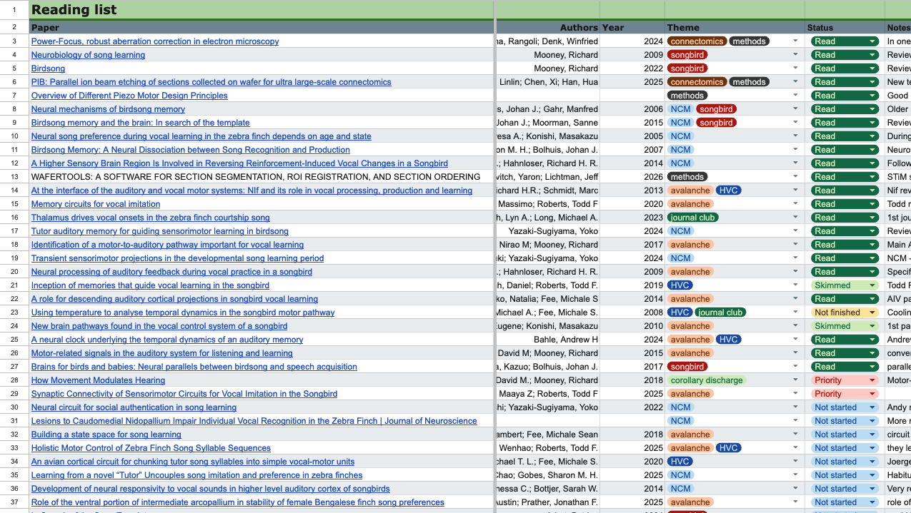
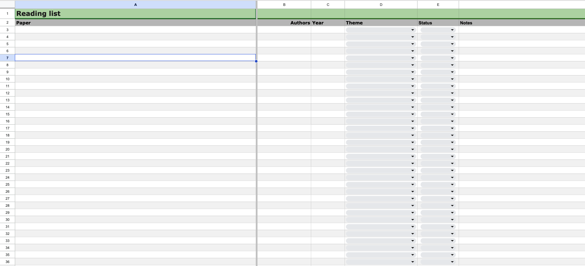
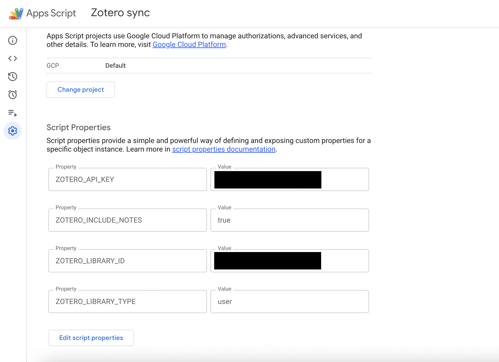
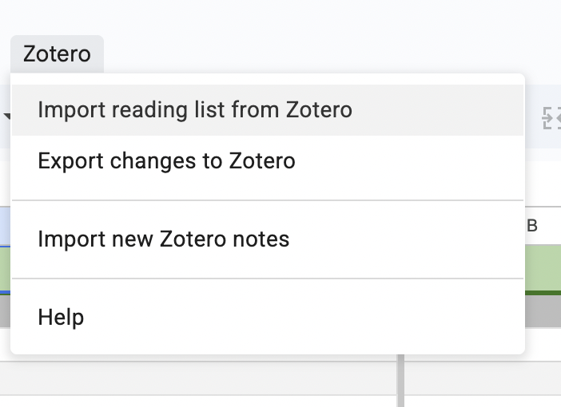
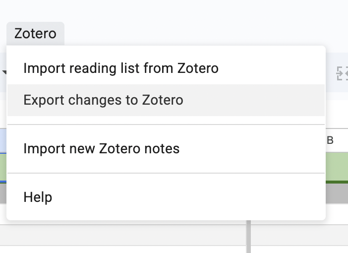
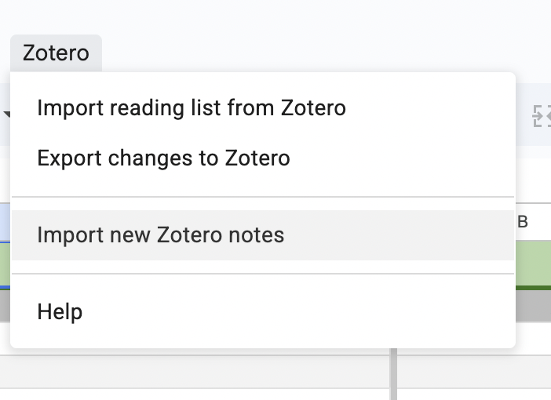

# Zotero plugin for Google Sheets

A Google Apps Script plugin that keeps your Zotero library in sync with Google Sheets. It imports your Zotero references into a Sheets reading list, where you can keep detailed notes on what you are reading, and lets you export those notes back to Zotero.

[link to tutorial]

## Installation

### 1) Download the Google Sheets template
1.	Open the template spreadsheet:
https://docs.google.com/spreadsheets/d/1JCRg0zxq62RRdxQ6xEfoExcsUBwBxrjyh8dmBHv5dxg/edit?usp=sharing
2.	In Google Sheets, go to File → Make a copy… to create your own editable copy.
3.	In your copy, check that the script is present:
    -	Go to Extensions → Apps Script
    -	If you can’t see the code there, copy the contents of the repository’s .gs file into Code.gs, then Save.

### 2) Obtain a Zotero API key and User ID
1. Navigate to www.zotero.org (web version — not the desktop app).
2. Go to **Profile → Settings → Security**.
3. Scroll down to find your **User ID**.
4. Click **Create new private key**.
5. Name your API key.
6. Make sure you enable:
   - **Allow library access**
   - **Allow notes access**
   - **Allow write access**

   If you do not enable all three, the plugin will not work.
7. Click **Save key** and copy the key somewhere safe.

---

### 3) Insert your Zotero credentials into Google Apps Script
1. In Google Sheets, go to **Extensions → Apps Script**.
2. Open **Project Settings → Script Properties** and add the following:

- `ZOTERO_LIBRARY_ID` — your Zotero **User ID**
- `ZOTERO_API_KEY` — your Zotero **API key**
- `ZOTERO_LIBRARY_TYPE` — set to `user`
- `ZOTERO_INCLUDE_NOTES` — set to `true`

4. Save.
5. Go back to Google Sheets and reload the page. You should see a new menu called **Zotero**. The first time you run a command, Google will prompt you to approve Apps Script permissions.

---

## User manual

### 5) Import the reading list into Google Sheets
1. In Zotero, tag all references you want to import with the tag **`reading list`**. The script uses this tag to determine what should appear in the Google Sheet.
2. In Google Sheets, use the menu: **Zotero → Import reading list from Zotero**.

The script will:
- Pull all Zotero items tagged `reading list`
- Build or refresh the reading list table in Sheets

The importer fills these columns:
- **Paper**: the Zotero title (hyperlinked to the best available source, e.g. DOI/URL when available)
- **Authors**
- **Year**
- **Theme**: derived from Zotero tags

---

### 7) Daily workflow in Sheets
Use the Sheet as your reading list dashboard:
- Update **Status** with your reading state:
  - Read / Skimmed / Priority / Not started / Not finished
- Write and maintain **Notes** while reading

Imports will not overwrite your Status or Notes. Sheets is intended to be your main place for note-taking and keeping your reading notes up to date.

---

### 8) Export your Sheet updates back to Zotero
When you have made changes in Google Sheets and want them reflected in Zotero:
- Use **Zotero → Export changes to Zotero**

This will:
- Update Zotero title and URL (including hyperlink deletions)
- Update Zotero tags (Theme tags + Status tag + `reading list`)
- Export your Sheet Notes into Zotero. This note will have the header **“Imported from Google Sheets”**.

If you changed core bibliographic fields (Paper/Authors/Year/url), you will be prompted to confirm export.

---

### 9) Import new Zotero notes into Sheets (append-only)
If you added notes directly in Zotero and want them reflected in Sheets (so your Sheet has all notes up to date):
- Use **Zotero → Import new Zotero notes**

This will:
- Scan the Zotero reading list for newly created notes
- Append new note snippets to your **Notes** cell in Sheets
- Mark imported notes in Zotero so they are not appended again

Next time you export from Sheets back to Zotero, the script will tidy organisation by consolidating previously imported notes (tag/marker-based) into the main note.

---

## Notes & behaviour

- Imports from Zotero won’t overwrite "Status" or "Notes" columns. New notes from Zotero are appended to the end of Notes in Sheets.
- If you remove a reference in Sheets (e.g. delete row) and then export changes back to Zotero, the `reading list` tag will be removed from that reference.
- **Theme options** are refreshed from Zotero tags at the start of import. You can customise the colour/appearance of Theme tags in Google Sheets via:
  **Data → Data validation rules** (e.g. the rule affecting the Theme column range such as `D3:D`).

---

## Troubleshooting

- If the menu doesn’t show, reload the spreadsheet.
- If the script errors due to missing config, confirm Script Properties exist:
  - `ZOTERO_LIBRARY_ID`, `ZOTERO_API_KEY`
- If hyperlinks don’t work, check the stored URL includes `https://`.
- If you use a **Zotero group library**, you’ll need to adjust API endpoints (`/groups/<id>/...`).

---

Any questions or feedback — happy to incorporate improvements : )

Reach out to frdfaa2@cam.ac.uk

---

## Licence
MIT Licence
